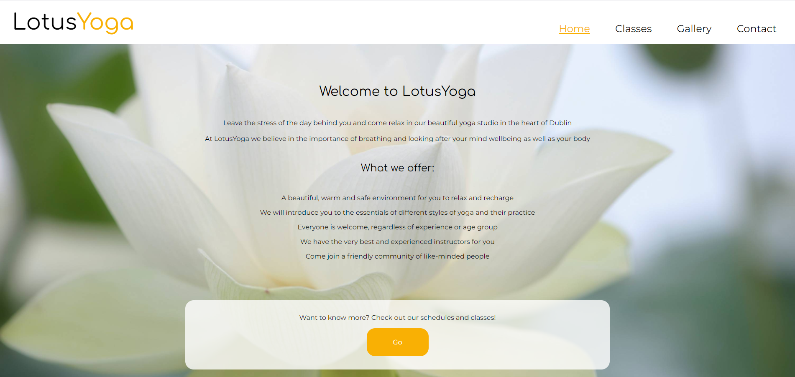
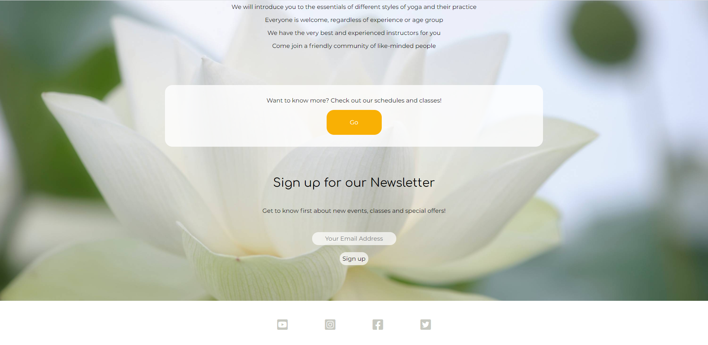
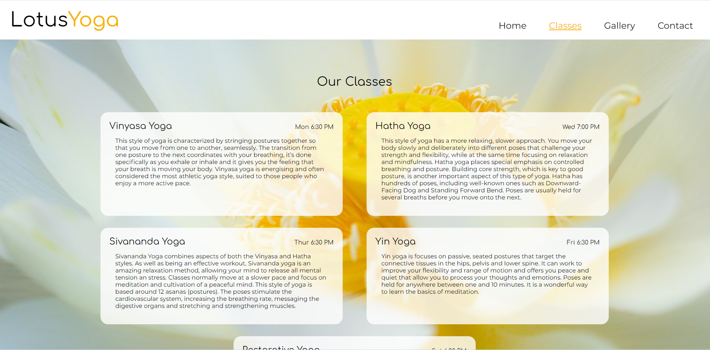
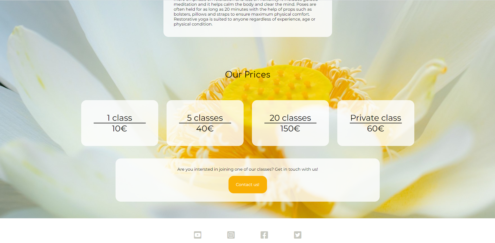
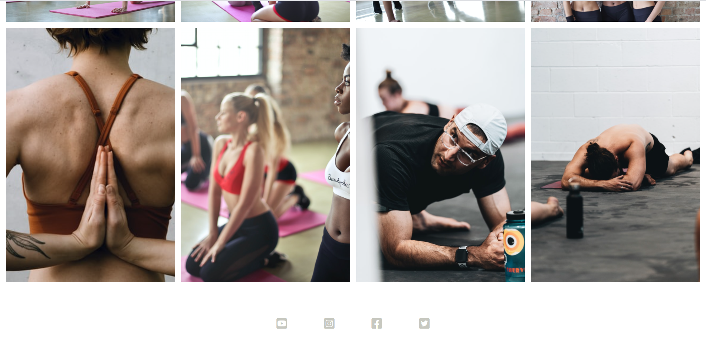
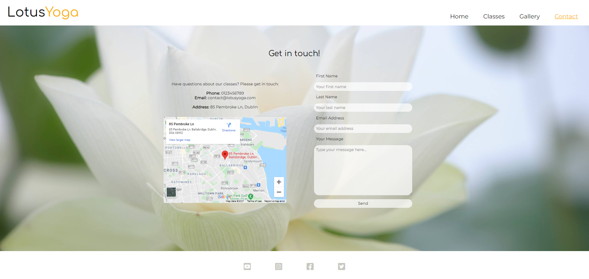
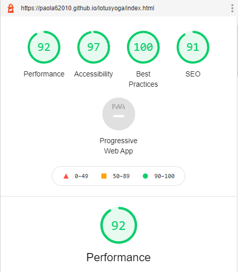
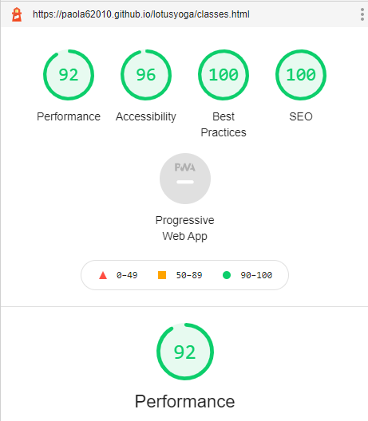
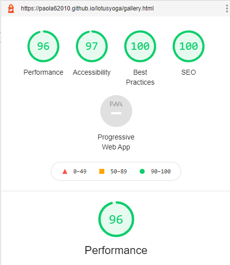
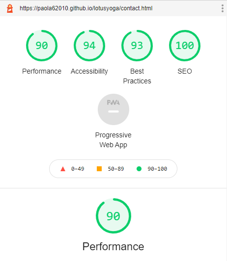

# LotusYoga Testing Details

[Main README.md file](https://github.com/Paola62010/lotusyoga/blob/master/README.md)

[Deployed site](https://paola62010.github.io/lotusyoga/)

## Validator Testing

The following validators were used to check the validity of the website code:

[W3C Makup Validation Service](https://validator.w3.org/)

[W3C CSS Valiation Service](http://jigsaw.w3.org/css-validator/)

No errors ae returned. There is only one warning message that advises to possibly include a heading to the HTML for the gallery page. In my opinion there is no need for a heading in this specific case as the user can clearly see they are on the gallery page from the navigation menu and no additional description is needed to introduce the pictures. 

## User Stories Testing 

User stories can be found in the UX section in the [README.md file](https://github.com/Paola62010/lotusyoga/blob/master/README.md)

1. As a new visitor to the website, I want to be able to navigate the website easily and find what I need efficiently.

    i. In all pages a clear navigation menu is present to take the customer to the different sections of the website. 

    ii. The logo redirects the visitor to the home page, as it would be expected. 

2. As a new visitor to the website I can see that the information is laid out clearly and I can navigate the website from different devices (desktop, tablet or phone).

    i. The information is clearly laid out and easy to find thanks to the main navigation menu that labels the content for each page. 

    ii. The webisite is responsive and can be viewed by the visitor on different size screens.

3. As an interested customer, I want to know more about the yoga classes offered and the schedule for each class. 

    i. A clearly labelled Classes page provide the visitor with all the information about the classes and schedules.

    ii. On the home page there is a call-to-action button that redirects the visitor to the classes page. 

4. As a potential customer I want to see the prices for the classes. 

    i. The Classes page includes price boxes showing the visitor the different prices according to the number of classes taken. 

5. As an interested customer, I want to be able to follow the Yoga center on social media so I can keep up with the latest news/updates.

    i. At the bottom of each page, the footer features links to 4 social media platforms

    ii. By clicking on the links, the visitor is redirected to the related social media platform website which opens in a new page. 

6. As an potential customer, I want to see pictures of the yoga classes, pictures have a good quality on different devices.

    i. A clearly labelled Gallery page shows the visitor pictures taken at the yoga studio. 

    ii. Pictures are clearly visible on different size screens. 

7. As a potential customer, I want to be able to get in touch with the yoga center.

    i. A clearly labelled Contact page provide the visitor with the contact information for the yoga studio.

    ii. The Contact page features a contact form that allows the user to send a message to the studio. 

8. As a potential customer I want to be able to locate the yoga studio on a map.

    i. The Contact page features a map that allows the user to locate the studio. 

9. As a returning customer I want to register to the yoga studio's newsletter so that I can get updates on promotions/events.

    i. At th bottom of the Home page, there is a small form that allows the user to sign up for the studio's newsletter.

## Manual Testing 

### Home Page 

1. Navigation Menu

    i. Click on the logo and verify that the link redirect to the home page. 

    ii. Hover over the 4 links in the navigation menu and verify that the color changes and the text is underlined.

    iii. Click on each link and verify it redirect to the correct page. 

2. Call-to-action button

    i. Click on the _Go_ button and verify that it redirects to the Classes page. 

3. Newsletter form

    i. Click on the input field and verify that the background color changes to white (full opacity).

    ii. Click on the submit button and verify that the background color changes to white (full opacity).

    iii. Try clicking on the submit button without entering the email address and verify that an error appears.

    iv. Try clicking on the submit button after entering an incorrect email address format and verify that an error appears. 

4. Footer 

    i. Hover over the 4 social media icons and verify that their color changes.

    ii. Click on each icon and verify that it redirects to the correct social media website.

    iii. Verify that the social media website opens in a new tab.

5. Checked the functionality on different size screens, content is responsive and clearly visible on all screens. 

#### Home Page (finished site)

### Classes Page 

1. Navigation Menu

    i. Follow same steps highlighted for the Home Page. 

2. Call-to-action button

    i. Click on the _Contact Us!_ button and verify that it redirects to the Contact Page. 

3. Footer

    i. Follow the same steps highlighted for the Home page. 

4. Checked the functionality on different size screens, content is responsive and clearly visible on all screens.

#### Classes Page (finished site)

### Gallery Page 

1. Navigation Menu

    i. Follow same steps highlighted for the Home Page.

2. Images 

    i. Check that the images are clearly visible and not distorted. 

3. Footer

    i. Follow same steps highlighted for the Home Page.

4. Checked the functionality on different size screens, content is responsive and clearly visible on all screens.

#### Gallery Page (finished site)

### Contact Page

1. Navigation Menu

    i. Follow same steps highlighted for the Home Page.

2. Contact Form

    i. Click on the different fields and verify that the background color changes to white (full opacity).

    ii. Click on the _Send_ button without filling the text fields and verify that an error appears. 

    iii. Click on the _Send_ button after entering an invalid format email address and verify that an error appears. 

    iv. Click on the _Send_ button after omitting the email address and verify that an error appears. 

3. Map

    i. Click on the plus and minus signs on the map and verify that zoom in and out works as expected.

    ii. Click and drag on the map to veriy that the map moves as expected. 

4. Footer 

    i. Follow same steps highlighted for the Home Page.

5. Checked the functionality on different size screens, content is responsive and clearly visible on all screens.

#### Contact Page (finished site)

## Additional Testing 

- Site was tested in different browsers and works nicely in all of them: Google Chrome, Safari, Firefox, Microsoft Edge.

- Used different devices for testing including: MacBook Pro, iPad Pro, iPhone 11 Pro and HP Pavillion Notebook. Latest operating system installed on all devices. 

- Extensive use of Google Chrome DevTools to test site perormance and responsiveness. 

- Use of Lighthouse feature on Google Chrome DevTools to test the site performance. Following results were achieved:

    - Home Page 

    

    - Classes Page 

    

    - Gallery Page

    

    - Contact Page 

    

